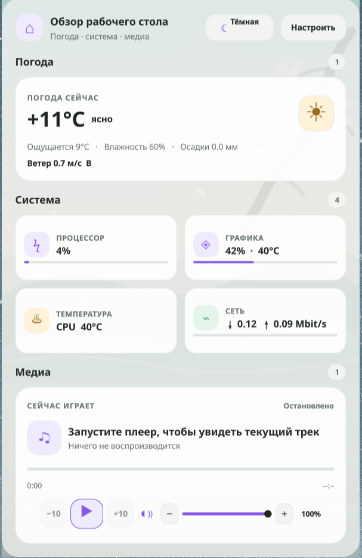

# Omarchy Customizations

Personal, user-owned customizations for Omarchy and Hyprland. This repository
contains the configuration, Quickshell plugins, and a small local monitoring
service used by the panel. It never modifies `/usr/share/omarchy`; all changes
are installed under the user's home directory.

[Watch the Omarchy desktop demo](docs/media/omarchy-demo.mp4)

[Watch the UI reference from 01:35 on YouTube](https://www.youtube.com/watch?v=J4LdlUgOGe8&t=95s)

## What This Repository Provides

### Hyprland configuration

`config/hypr/` contains the Lua configuration loaded by Omarchy:

- keyboard shortcuts and application bindings;
- input, appearance, animation, and layer rules;
- optional monitor and scale overrides through `OMARCHY_MONITOR` and
  `OMARCHY_SCALE`;
- startup hooks and Omarchy defaults;
- the subtle blur and alpha rules used by the desktop widgets.

The configuration is expressed as Omarchy-compatible user files, so package
updates do not overwrite it.

### Omarchy bar and desktop plugins

All plugins are regular Quickshell components. They use the existing Omarchy
theme, spacing, icon, and popup primitives instead of replacing the shell.

The repository ships configuration for ten Quickshell plugins:

- `health` reports CPU, memory, disk, and temperature values.
- `kvm-status` reports `/dev/kvm`, loaded KVM modules, running virtual-machine
  processes, and the detected private-network interface. It is read-only and
  treats malformed backend output as unavailable instead of throwing QML
  errors.
- `weather` fetches and formats the configured weather location.
- `bluetooth-battery` shows battery levels for connected Bluetooth devices.
- `vpn-monitor` provides VPN state and on-demand diagnostics through the local
  monitor service.
- `notifications-indicator` is the compact unread counter and history entry
  point.
- `notifications.local` receives notifications over D-Bus, keeps a bounded
  local history, and persists only the unread count.
- `clipboard.local` captures local clipboard history and exposes the overlay
  actions described below.
- `music-desktop` renders the click-through desktop music visualizer and clock.
- `widgets` renders the editable weather, system, network, and media dashboard.

`kvm-status`, `health`, and the metric backends use defensive parsing and
portable paths. A missing device, process, or metric is represented as an
unknown or empty value rather than a false positive.

#### `health`

Read-only CPU, memory, disk, and temperature information. It is a compact bar
indicator with a detail view and does not change system state.

#### `weather`

Weather status in the bar with a detail popup. Network and formatting logic are
kept separate from the visual component and follow the panel's layout rules.

#### `clipboard.local`

Local clipboard history with a capture helper. History stays on the machine and
is not committed to the repository. Sensitive clipboard entries are filtered
using the existing desktop metadata conventions.

The overlay keeps keyboard handling local to the focused clipboard surface:

| Shortcut | Action |
| --- | --- |
| `Enter` | Paste the selected item |
| `Shift+Enter` | Copy the selected item |
| `Alt+Enter` | Open the selected item with the desktop handler |
| `Ctrl+Delete` or `Delete` | Confirm, then clear the full history |
| `Esc` | Clear the filter, or close the overlay when it is empty |

The capture helper applies `umask 077`; runtime history and image files stay
private in the user's state directory. To limit memory and disk use, it skips
text entries larger than 256 KiB, images larger than 2 MiB, and keeps at most
100 cached images.

Only `Ctrl+Delete` is handled by the shortcut map; the focused overlay also
routes `Delete` to the same confirmation flow. Save-as and pin actions are not
exposed because this plugin does not implement those operations.

#### `notifications.local` and `notifications-indicator`

The notification service receives D-Bus notifications, stores a bounded local
history, handles Do Not Disturb, and exposes the unread bell in the bar. The
indicator supports opening history, marking notifications read, and clearing
entries. Runtime history lives below `~/.local/state/omarchy/notifications/`
and is excluded from version control.

#### `music-desktop`

The click-through desktop music visualizer and clock. Spectrum parsing and cat
motion are isolated in small JavaScript modules, with bounded Cava restart and
stale-data handling.

#### `widgets`

A desktop dashboard for weather, CPU/GPU load, temperature, network activity,
and MPRIS media playback. The dashboard keeps real backend data and separates
the read-only display from its layout editor.

- Reorder tiles within a section or move them between sections by dragging.
- Add, remove, rename, reorder, and reset sections. Add or remove tiles from a
  catalog, resize supported tiles across a two-column grid, and reset a tile's
  size or the complete layout.
- Choose automatic, light, or dark mode; select separate SVG wallpapers and
  wallpaper opacity for each theme; tune panel and tile opacity independently;
  switch between minimal and color weather icons.
- Persist the versioned layout at
  `$XDG_STATE_HOME/omarchy/widgets/layout.json`, or at
  `~/.local/state/omarchy/widgets/layout.json` when `XDG_STATE_HOME` is unset.
- Show the current track, artist, playback state, and elapsed/remaining time.
  Seek by dragging the progress bar or use the −10/+10-second controls. The
  central button toggles play/pause; right-click or a long press sends Stop.
- Adjust the selected MPRIS player's own volume with a slider, mute toggle, and
  small step buttons. Reads and writes use the same player target as the track
  metadata; the widget does not change the system-wide mixer level.

The layout editor and appearance controls are documented in
[the 26 September change notes](docs/2026-09-26.md).

#### `omarchy.bluetooth`

The stock Omarchy Bluetooth panel remains enabled. It is the control surface for
Bluetooth and provides adapter power on/off, active discovery, device search,
pairing, connection and disconnection, forgetting paired devices, keyboard
navigation, and accessible action feedback.

This repository does not replace that panel with a custom Bluetooth command
runner. The custom VPN widget uses a dedicated IPC namespace so it does not
collide with Omarchy's built-in targets during shell reloads.

#### `bluetooth-battery`

A separate, read-only charge indicator placed beside the stock Bluetooth
control. It keeps the charge percentage visible without taking away pairing or
connection controls.

BlueZ D-Bus is preferred, UPower is a fallback, and an unavailable percentage
is shown as unknown rather than as a misleading `0%`. The widget supports
device classification, charging state, and severity colors. It never runs
`bluetoothctl` or other system commands from QML.

#### `vpn-monitor`

A compact VPN status and diagnostics notification for the right side of the
bar. It displays the selected client's connection state, interface, external
IP, country, WARP status, latency, HTTP checks, traffic counters, and speed
test results.

The frontend consumes JSON from the local API and sends actions back to that
API. It does not inspect processes, routes, network interfaces, or VPN
configuration itself. Diagnostic buttons have independent busy states, so a
running ping does not disable the speed test and vice versa. Background status
polling does not make controls flicker.

VPN detection is conservative. A process alone is not considered a connected
VPN. The monitor combines client presence, interface state, IP assignment,
routes, handshake information where available, and an internet or proxy probe.
Supported detection profiles include WireGuard, OpenVPN, AmneziaVPN,
AmneziaWG, Outline, Cloudflare WARP, and the local Throne profile. VPN control
adapters are not enabled unless a documented safe adapter is configured; the
default installation is read-only.

### Local backend

`backend/vpn_monitor/` is the Python service used by the VPN and Bluetooth
plugins. It listens only on `127.0.0.1:8765` and provides:

- `GET /health`;
- `GET /api/v1/status`;
- `GET /api/v1/vpn/clients`;
- `GET /api/v1/bluetooth/status`;
- `POST /api/v1/diagnostics/connectivity`;
- `POST /api/v1/diagnostics/speed-test`;
- speed-test status and cancellation endpoints;
- selected-client settings.

System state is read through structured Linux interfaces and bounded commands.
Counters and diagnostics are kept in memory; the selected-client preference is
stored in the user's local state directory. There are no credentials, VPN
keys, tokens, or passwords in the service.

The user unit is `config/systemd/user/omarchy-vpn-monitor.service`. It uses
systemd's `%h` home-directory specifier and is portable across user names and
installations.

## Requirements

- Omarchy with Hyprland and Quickshell;
- Python 3.11 or newer for the optional monitor service;
- `bash`, `jq`, `notify-send`, `hyprctl`, and `omarchy-shell`;
- BlueZ for Bluetooth discovery and battery data;
- UPower is recommended as a battery fallback, but is not required;
- optional: `qmllint`, `qmltestrunner`, and `wtype` for deeper QML and E2E
  checks.

## Installation

From the repository root:

```bash
./scripts/check.sh
./scripts/install.sh
./scripts/smoke.sh
```

`install.sh` validates the repository, snapshots every managed path, stages a
clean replacement, reloads the user units, starts both services, and reloads
the Omarchy shell and Hyprland. Service and reload failures stop the install.
If a later step fails, the previous files and service states are restored from
the recorded backup. Backups use a unique directory name and include a
manifest of paths that did not exist before installation.

For isolated installer tests, `CUSTOMIZATIONS_HOME` and
`CUSTOMIZATIONS_STATE` may point at a temporary home and state directory.

The installer writes only to user-owned locations:

```text
~/.config/hypr/
~/.config/omarchy/
~/.config/systemd/user/
~/.local/share/omarchy/vpn-monitor/
~/.local/state/omarchy/
```

Monitor overrides can be supplied before installation:

```bash
export OMARCHY_MONITOR=DP-1
export OMARCHY_SCALE=1.0
./scripts/install.sh
```

Leave these variables unset to use Omarchy's automatic monitor setup.

## Verification

Run the repository checks after installation:

```bash
./scripts/check.sh
./scripts/smoke.sh
systemctl --user status omarchy-vpn-monitor.service
curl http://127.0.0.1:8765/health
```

The checks validate JSON manifests, shell syntax for repository scripts and
hooks, Python compilation, systemd units, backend contracts, notification
logic, and isolated install/uninstall behavior. Optional QML tools and
`shellcheck` are reported as `SKIP` when they are not installed; they are never
treated as passing tests.
The backend contract tests can be run against this checkout with:

```bash
PYTHONPATH=backend python -m unittest discover -s tests -q
```

The repository does not include live VPN control tests. Those require a
separate disposable VPN profile and could otherwise interrupt an active
connection.

The plugin-level smoke tests can be run directly as well:

```bash
bash config/omarchy/plugins/clipboard.local/tests/test_clipboard.sh
bash config/omarchy/plugins/music-desktop/tests/test_music_desktop.sh
node tests/test_notifications_logic.js
PYTHONPATH=backend python -m unittest discover -s tests -q
```

See the [test guide](tests/README.md) for all focused tests and the separate
live smoke checks.

These checks cover the shortcut map, clipboard manifest and shell syntax,
music animation logic, notification input handling, backend JSON contracts,
and read-only VPN/Bluetooth probes. They do not require a live VPN connection
or modify network configuration.

## Privacy and portability

Screenshots in `docs/media/` and the desktop demo are intentional documentation
assets. Runtime databases and state are generated locally and ignored by Git.
Source and documentation paths use `$HOME` or XDG locations rather than an
author-specific absolute home path. A targeted audit of the current
non-ignored tree found no high-confidence credential patterns or absolute
home-directory paths; the audit notes also record a path in older Git history.
The only local API service listens on `127.0.0.1:8765`.

The backend discovers the optional Throne client through `PATH` and process
metadata; it does not depend on a particular user's home directory. Bluetooth
and VPN data are read from the local machine and are not uploaded by these
plugins.

## Automatic game mode for the local LLM

`llama-game-guard.service` watches Hyprland's structured client and monitor
state once per second. It pauses the Qwen server before a known game has been
fullscreen on the monitor for two consecutive samples, and resumes the stack
after three samples without a game. Detection requires both fullscreen
geometry and a game identity such as a `steam_app_*` class, Gamescope, a
Proton/Wine executable, or a configured game title. Normal fullscreen browser,
terminal, desktop, and editor windows are rejected.

The guard stops the worker pool, API router, health watchdog, and Qwen server
in dependency order. It starts them in reverse order when the game exits, so
the health watchdog cannot immediately undo the pause. The detector has a
`--dry-run --once` mode for diagnostics and uses no polling of pixels,
keyboard input, or privileged system APIs.

The service only manages the four local Qwen units listed above. It does not
kill game processes, change Hyprland settings, unload kernel modules, or touch
other GPU applications. A systemd stop or logout leaves the Qwen stack under
the user's normal control.

The installer places the program at `~/.local/bin/llama-game-guard` and enables
the user unit. To inspect its decisions:

```bash
journalctl --user -u llama-game-guard.service -f
~/.local/bin/llama-game-guard --dry-run --once
```

## Changes on 26 September 2026

The desktop widget was redesigned around a consistent two-column tile grid and
matte cards, with light/dark themes, adjustable wallpaper and surface opacity,
and a persistent layout editor. The media card now uses one stable MPRIS target
for metadata, transport, seeking, and player volume. The weather, notification,
clipboard, KVM, VPN, monitor configuration, and install/uninstall paths received
input bounds, safer parsing, or additional regression coverage. Detailed
interaction, implementation, and verification notes are in
[docs/2026-09-26.md](docs/2026-09-26.md).



Additional screenshots cover both themes, the tile editor, appearance
settings, and the media controls. See the change notes for the complete list.

## Changes from 25 September 2026

This update records the changes made during the local Omarchy and Hyprland audit.

### Music desktop plugin

The music desktop service now has a tested spectrum parser in
`config/omarchy/plugins/music-desktop/SpectrumParser.js`. It always produces the
configured number of bands, clamps invalid values, pads short Cava lines, and
handles malformed input without producing `NaN` values.

The cat motion code now uses shared sprite geometry, rejects invalid stage
sizes, keeps the image and movement bounds aligned, and caches the calculated
pose once per animation frame. Dragging preserves the pointer offset, handles
cancelled gestures, clamps release positions to the floor, and restores a safe
resting pose when music stops.

The service now runs one shared cat stage on the first available screen. This
avoids conflicting global physics state when more than one monitor is present.
The Cava process reports stderr, clears stale spectrum data after 1.2 seconds,
restarts with exponential backoff, and stops after five consecutive failures.
A successful audio sample resets the failure counter.

The plugin tests now include static checks, CatMotion unit and edge tests,
spectrum parser tests, regression checks for hitboxes and lifecycle behavior,
and a smoke test that starts Cava and loads the QML component through
Quickshell.

### Shell configuration

The repository's `config/omarchy/shell.json` is synchronized with the active
user configuration. It includes the `kvm-status` widget in the center layout,
keeps the desktop shell transparent, and records the local clipboard and
notification clone settings.

### VPN monitor

The speed test now forces HTTP/1.1 for both download and upload requests. This
avoids intermittent TLS failures through the local Throne SOCKS proxy. The
behavior is covered by a unit test and documented in the test guide. A bounded
VPN speed smoke test is also included; it requires the local monitor service and
an active tunnel.

### Demo media

The README demo is an AV1 MP4 without an audio track:
`docs/media/omarchy-demo.mp4`. The previous GIF has been removed; the source
video was transcoded locally.

### Verification

The music desktop plugin passed its static, unit, edge, parser, Cava stream,
and Quickshell loading checks. JSON, JavaScript, and shell syntax checks also
passed. `hyprctl configerrors` returned no errors. The repository checks should
be run from the repository root before installation:

```bash
./scripts/check.sh
bash config/omarchy/plugins/music-desktop/tests/test_music_desktop.sh
bash config/omarchy/plugins/music-desktop/tests/test_regressions.sh
node config/omarchy/plugins/music-desktop/tests/cat-motion-test.js
node config/omarchy/plugins/music-desktop/tests/cat-motion-edge-test.js
node config/omarchy/plugins/music-desktop/tests/spectrum-parser-test.js
bash config/omarchy/plugins/music-desktop/tests/smoke_music_desktop.sh
PYTHONPATH=backend python -m unittest discover -s tests -q
```


## Uninstall

```bash
./scripts/uninstall.sh
```

The uninstall script requires the install backup record, stops and disables
the two managed services, restores every file that existed before installation,
reloads systemd, and reloads the shell and Hyprland. It keeps a rollback
snapshot of the current files and does not delete notification history or other
user state.

## License

MIT. See [LICENSE](LICENSE).
