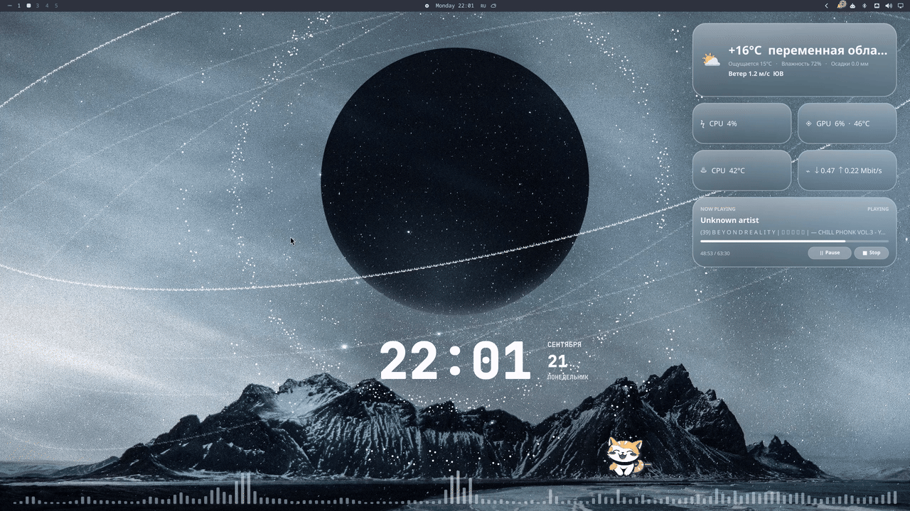

# Omarchy Customizations

Personal, user-owned customizations for Omarchy and Hyprland. This repository
contains the configuration, Quickshell plugins, and a small local monitoring
service used by the panel. It never modifies `/usr/share/omarchy`; all changes
are installed under the user's home directory.



## What This Repository Provides

### Hyprland configuration

`config/hypr/` contains the Lua configuration loaded by Omarchy:

- keyboard shortcuts and application bindings;
- input, appearance, animation, and layer rules;
- optional monitor and scale overrides through `OMARCHY_MONITOR` and
  `OMARCHY_SCALE`;
- startup hooks and Omarchy defaults;
- the glass layer used by the desktop widgets.

The configuration is expressed as Omarchy-compatible user files, so package
updates do not overwrite it.

### Omarchy bar and desktop plugins

All plugins are regular Quickshell components. They use the existing Omarchy
theme, spacing, icon, and popup primitives instead of replacing the shell.

#### `health`

Read-only CPU, memory, disk, and temperature information. It is a compact bar
indicator with a detail view and does not change system state.

#### `weather`

Weather status in the bar with a detail popup. Network and formatting logic are
kept separate from the visual component and follow the panel's layout rules.

#### `clipboard.local`

Local clipboard history with a capture helper. History stays on the machine and
is not committed to the repository. Sensitive clipboard entries are filtered
using the existing desktop metadata conventions.

#### `notifications.local` and `notifications-indicator`

The notification service receives D-Bus notifications, stores a bounded local
history, handles Do Not Disturb, and exposes the unread bell in the bar. The
indicator supports opening history, marking notifications read, and clearing
entries. Runtime history lives below `~/.local/state/omarchy/notifications/`
and is excluded from version control.

#### `music-desktop` and `widgets`

Desktop-layer widgets for music, weather, network, system metrics, and the
visualizer. They are click-through where appropriate and use the Omarchy glass
surface without adding a separate window-manager layer.

#### `omarchy.bluetooth`

The stock Omarchy Bluetooth panel remains enabled. It is the control surface for
Bluetooth and provides adapter power on/off, active discovery, device search,
pairing, connection and disconnection, forgetting paired devices, keyboard
navigation, and accessible action feedback.

This repository does not replace that panel with a custom Bluetooth command
runner.

#### `bluetooth-battery`

A separate, read-only charge indicator placed beside the stock Bluetooth
control. It keeps the charge percentage visible without taking away pairing or
connection controls.

BlueZ D-Bus is preferred, UPower is a fallback, and an unavailable percentage
is shown as unknown rather than as a misleading `0%`. The widget supports
device classification, charging state, and severity colors. It never runs
`bluetoothctl` or other system commands from QML.

#### `vpn-monitor`

A compact VPN status and diagnostics notification for the right side of the
bar. It displays the selected client's connection state, interface, external
IP, country, WARP status, latency, HTTP checks, traffic counters, and speed
test results.

The frontend consumes JSON from the local API and sends actions back to that
API. It does not inspect processes, routes, network interfaces, or VPN
configuration itself. Diagnostic buttons have independent busy states, so a
running ping does not disable the speed test and vice versa. Background status
polling does not make controls flicker.

VPN detection is conservative. A process alone is not considered a connected
VPN. The monitor combines client presence, interface state, IP assignment,
routes, handshake information where available, and an internet or proxy probe.
Supported detection profiles include WireGuard, OpenVPN, AmneziaVPN,
AmneziaWG, Outline, Cloudflare WARP, and the local Throne profile. VPN control
adapters are not enabled unless a documented safe adapter is configured; the
default installation is read-only.

### Local backend

`backend/vpn_monitor/` is the Python service used by the VPN and Bluetooth
plugins. It listens only on `127.0.0.1:8765` and provides:

- `GET /health`;
- `GET /api/v1/status`;
- `GET /api/v1/vpn/clients`;
- `GET /api/v1/bluetooth/status`;
- `POST /api/v1/diagnostics/connectivity`;
- `POST /api/v1/diagnostics/speed-test`;
- speed-test status and cancellation endpoints;
- selected-client settings.

System state is read through structured Linux interfaces and bounded commands.
Counters and diagnostics are kept in memory; the selected-client preference is
stored in the user's local state directory. There are no credentials, VPN
keys, tokens, or passwords in the service.

The user unit is `config/systemd/user/omarchy-vpn-monitor.service`. It uses
systemd's `%h` home-directory specifier and is portable across user names and
installations.

## Requirements

- Omarchy with Hyprland and Quickshell;
- Python 3.11 or newer for the optional monitor service;
- `bash`, `jq`, `notify-send`, `hyprctl`, and `omarchy-shell`;
- BlueZ for Bluetooth discovery and battery data;
- UPower is recommended as a battery fallback, but is not required;
- optional: `qmllint`, `qmltestrunner`, and `wtype` for deeper QML and E2E
  checks.

## Installation

From the repository root:

```bash
./scripts/check.sh
./scripts/install.sh
./scripts/smoke.sh
```

`install.sh` creates a timestamped backup of the current Hyprland and Omarchy
shell configuration, installs user plugins, copies the Python backend, installs
the systemd user unit, reloads the unit files, and starts the monitor. It then
reloads the Omarchy shell and Hyprland where available.

The installer writes only to user-owned locations:

```text
~/.config/hypr/
~/.config/omarchy/
~/.config/systemd/user/
~/.local/share/omarchy/vpn-monitor/
~/.local/state/omarchy/
```

Monitor overrides can be supplied before installation:

```bash
export OMARCHY_MONITOR=DP-1
export OMARCHY_SCALE=1.0
./scripts/install.sh
```

Leave these variables unset to use Omarchy's automatic monitor setup.

## Verification

Run the repository checks after installation:

```bash
./scripts/check.sh
./scripts/smoke.sh
systemctl --user status omarchy-vpn-monitor.service
curl http://127.0.0.1:8765/health
```

The checks validate JSON manifests, shell syntax, backend compilation, the
local notification path, and panel geometry. Optional QML tools are reported
as `SKIP` when they are not installed; they are never treated as passing tests.
The backend contract tests can be run against this checkout with:

```bash
PYTHONPATH=backend python -m unittest discover -s tests -q
```

The repository does not include live VPN control tests. Those require a
separate disposable VPN profile and could otherwise interrupt an active
connection.

## Privacy and portability

This repository contains no credentials, private keys, tokens, passwords,
notification databases, screenshots, or machine-specific home-directory
paths. Runtime state is generated locally and ignored by Git. The only
network-facing service is the loopback monitor on `127.0.0.1:8765`.

The backend discovers the optional Throne client through `PATH` and process
metadata; it does not depend on a particular user's home directory. Bluetooth
and VPN data are read from the local machine and are not uploaded by these
plugins.

## Uninstall

```bash
./scripts/uninstall.sh
```

The uninstall script moves installed custom plugin directories into a
timestamped backup. It does not delete notification history or other user
state.

## License

MIT. See [LICENSE](LICENSE).
